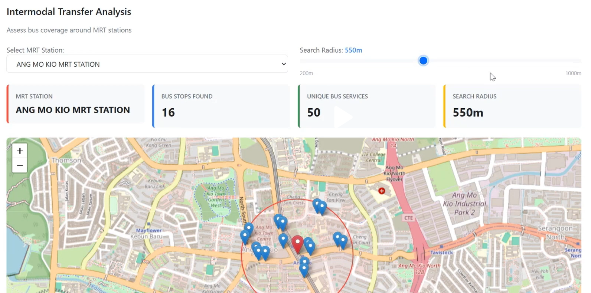

## Intermodal Transfer Analysis: Bus Coverage Around MRT Stations

### What Was Visualized

This interactive dashboard analyzes the integration between Singapore's MRT (Mass Rapid Transit) and bus network systems. The visualization displays:

- **Geographic data**: Interactive map showing the spatial distribution of bus stops around a selected MRT station
- **Key metrics displayed**:
  - Number of bus stops within a specified search radius (16 stops)
  - Number of unique bus services available (50 services)
  - Search radius parameter (adjustable from 200m to 1000m, currently set at 550m)
- **Visual elements**:
  - Blue markers representing individual bus stops
  - Red marker indicating the selected MRT station (Ang Mo Kio MRT)
  - Red circle showing the search radius coverage area
  - Base map with street-level detail for context

### The Story Behind It

**Context**: This project was developed as part of my coursework in Data Engineering & Visualization at Singapore Institute of Technology, where we explored Singapore's public transport connectivity and accessibility.

**Objective**: To assess the first-mile/last-mile connectivity of Singapore's public transport system by measuring how well bus services support MRT stations. This analysis helps identify:
- Areas with strong intermodal integration
- Potential gaps in feeder bus coverage
- Optimal transfer points for commuters

**Problem Statement**: Commuters often need to use multiple transport modes to complete their journeys. Understanding the density and variety of bus services around MRT stations is crucial for:
- Urban transport planning
- Evaluating accessibility for residents
- Optimizing feeder bus routes

### Why This Visualization Approach?

I chose this combination of interactive map and summary metrics because:

1. **Geographic context is essential**: Transport connectivity is inherently spatial - showing the physical distribution of bus stops reveals coverage patterns that numbers alone cannot convey

2. **Interactive exploration**: The dropdown selector and adjustable search radius allow users to:
   - Compare different MRT stations
   - Test various walking distance assumptions (200m to 1km)
   - Discover localized patterns specific to each neighborhood

3. **Quantitative metrics provide clarity**: The key performance indicators (16 bus stops, 50 unique services) give immediate numerical context to the visual patterns

4. **Layered information hierarchy**: The design presents information in progressive detail:
   - High-level summary cards for quick insights
   - Map visualization for spatial understanding
   - Individual markers for granular exploration

### Technical Implementation

**Data Sources**:
- LTA DataMall API: Real-time bus stop locations and service information
- OneMap API: MRT station coordinates
- OpenStreetMap: Base map tiles

**Tools & Technologies**:
- **Python**: Data processing and API integration
- **Pandas**: Data manipulation and cleaning
- **Folium/Leaflet.js**: Interactive map visualization
- **Streamlit/Dash**: Web application framework (if applicable)
- **Geopy**: Geospatial distance calculations

**Key Technical Challenges**:
- Handling large datasets (thousands of bus stops across Singapore)
- Calculating accurate geodesic distances on Earth's curved surface
- Optimizing map rendering performance for smooth user interaction
- Ensuring data accuracy and real-time synchronization with LTA systems

### Key Insights Discovered

From analyzing multiple MRT stations:

1. **Central stations have higher coverage**: Stations in mature estates like Ang Mo Kio, Bishan, and Tampines show 40-60 unique bus services within 550m

2. **Search radius impact**: Increasing the search radius from 200m to 550m typically doubles the number of accessible bus services, but beyond 800m, the rate of increase slows significantly

3. **Network hub identification**: Certain stations (like Ang Mo Kio in this example) serve as major interchange points with extensive feeder networks

4. **Coverage disparities**: Newer MRT stations in developing areas may have fewer bus connections, highlighting areas for transport planning attention

### Real-World Applications

This analysis framework can be used for:
- **Transport planning**: Identifying areas requiring additional feeder bus services
- **Property development**: Assessing transport connectivity for new residential projects
- **Commuter apps**: Helping users find optimal transfer points
- **Research**: Studying the evolution of Singapore's integrated transport network

### Reflection

This project taught me the importance of combining multiple visualization techniques - quantitative metrics, geographic representation, and interactive elements - to tell a complete story. The key learning was that effective data visualization isn't just about displaying data; it's about enabling users to explore and derive their own insights.

The interactive nature of this dashboard allows different stakeholders (urban planners, researchers, commuters) to use the same tool for different purposes, demonstrating the power of flexible, user-driven visualization design.

---

*This visualization was created as part of my Data Engineering & Visualization coursework, demonstrating the application of geospatial analysis and interactive dashboard design to real-world urban transport challenges.*